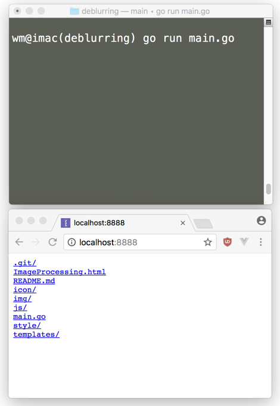
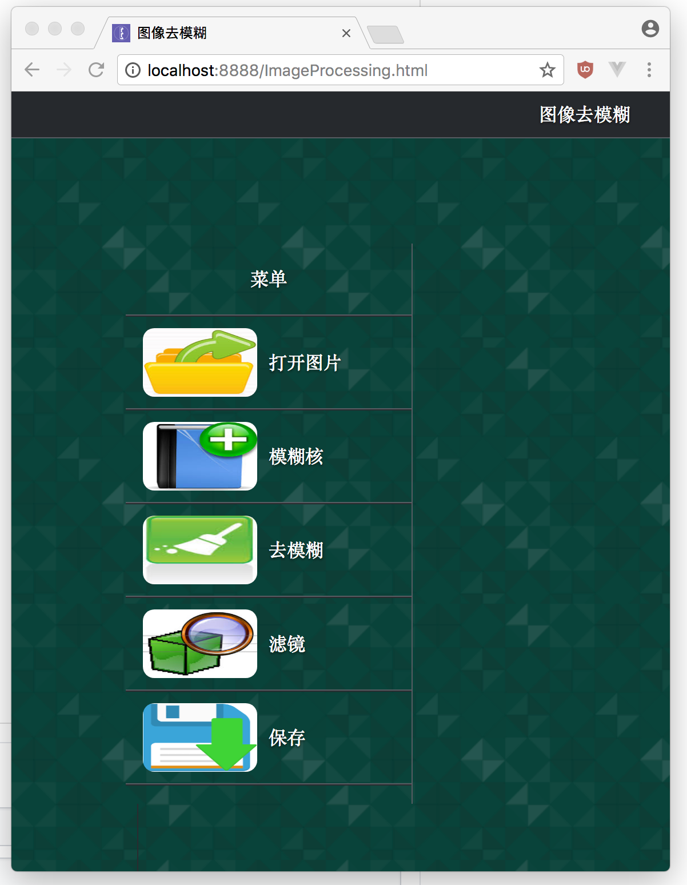

#图像去模糊应用
一定程度上使运动模糊，高斯模糊的图像恢复清晰
# Image Deblurring
golang; wiener filter; fftw

# Installation / Usage

## OSX

1. `brew install fftw`
2. `go get github.com/h1k0n/deblurring`
3. `cd $GOPATH/src/github.com/h1k0n/deblurring`
4. `go run main.go`
5. open localhost:8888 in web browser

6. click ImageProcessing.html

